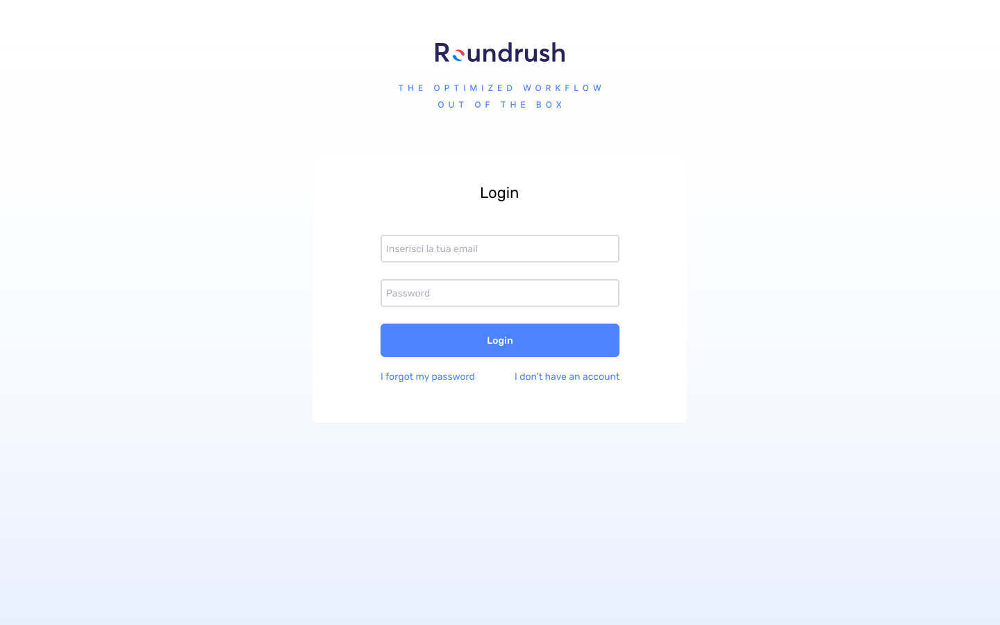
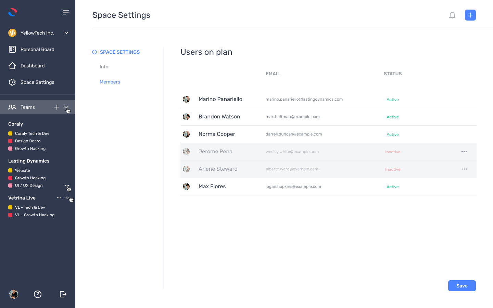

# RoundRush

 
**RoundRush** is a kanban board for teams in software engineering,
built using _ReactJs_ _TypeScript_ _Redux_ _MaterialUI_ 

### Screenshots

 

### How to use

1. Clone/Download the repository.
2. Install dependencies:
   <code>yarn install</code> or <code>npm install</code>
3. Run <code>yarn start</code> or <code>npm start</code>.
4. You are ready [http://localhost:3000](http://localhost:3000)
